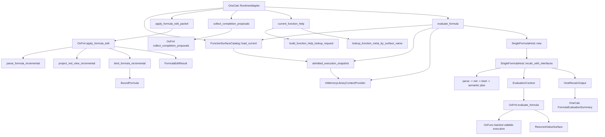
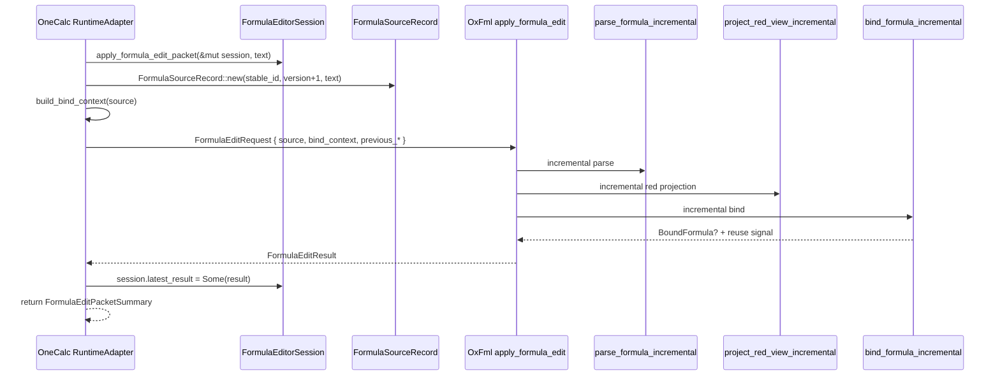
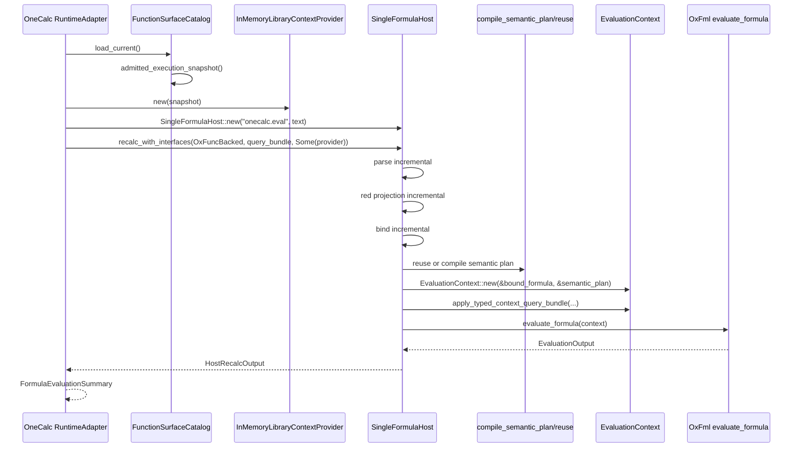
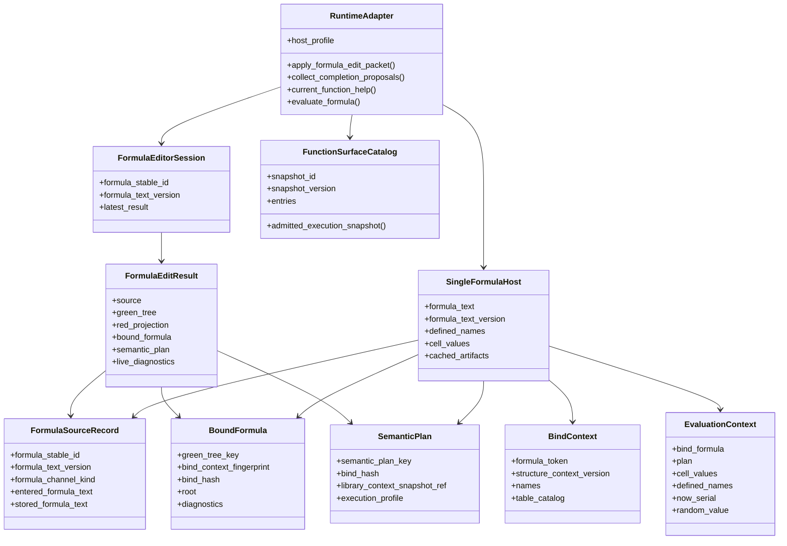

# OC-H1 Engine X-Ray

> Snapshot date: `2026-04-02`
>
> Stage: current `OC-H1` explorer-and-xray spine, realigned against the landed `OxFml_V1` downstream-consumer contract, the current OxFunc metadata/help contract, and the current OxReplay OneCalc consumption model.
>
> Scope: current `DnaOneCalc` engine path and the upstream seam alignment that now frames it.
> Exclusions for this pass: final replay/observation/compare architecture, GUI rendering and widget layout, and extension ABI/RTD rollout.
> Focus: how `DnaOneCalc` initializes and uses `OxFml` and `OxFunc`, which upstream contracts now frame that code, what state and immutable structures flow through the current slice, and what this implies for the next explorer, X-Ray, and replay iterations.

## 1. What This Document Is For

This is a source-level x-ray of the current OneCalc `OC-H1` implementation slice.

It is meant to answer these questions precisely:

1. Where does OneCalc create the structures that drive formula edit and formula evaluation?
2. How does OneCalc turn OxFunc inventory data into an admitted runtime surface?
3. What data structures are created, cloned, cached, or reused across edit and eval?
4. Where is mutable state kept, and where are immutable versioned artifacts already present?
5. How close is the current design to a future model with snapshot-based, concurrent, and eventually async-friendly execution?
6. How should this engine slice now be read against the current `OxReplay` alignment, and what still sits outside the engine path described here?

This is not a product-spec note. It is a code map.

## 2. Engine Scope In One Sentence

The current engine spine is:

1. load an OxFunc-derived function-surface catalog,
2. derive an admitted `LibraryContextSnapshot`,
3. use `OxFml` language-service APIs for edit/diagnostic/completion/help,
4. use `OxFml` host APIs for real evaluation through `SingleFormulaHost`,
5. surface the reduced result back to OneCalc as explorer and X-Ray truth,
6. stop short of a fully designed replay/observation operation model.

## 3. High-Level Ownership Map

### 3.1 Local OneCalc Code

The current local engine-owning files are:

- `src/dnaonecalc-host/src/function_surface.rs`
- `src/dnaonecalc-host/src/runtime.rs`

The current package wiring lives in:

- `src/dnaonecalc-host/Cargo.toml`

Relevant dependency declarations:

```toml
oxfml_core = { path = "../../../OxFml/crates/oxfml_core" }
oxfunc_core = { path = "../../../OxFunc/crates/oxfunc_core" }
oxreplay-core = { path = "../../../OxReplay/src/oxreplay-core" }
oxreplay-abstractions = { path = "../../../OxReplay/src/oxreplay-abstractions" }
```

For this document, only `oxfml_core` and the OxFunc function-lane data exports matter.

### 3.2 Upstream OxFml Code And Contracts Actually Exercised

The OneCalc engine currently relies on these OxFml areas:

- `../OxFml/crates/oxfml_core/src/source.rs`
- `../OxFml/crates/oxfml_core/src/binding/mod.rs`
- `../OxFml/crates/oxfml_core/src/interface/mod.rs`
- `../OxFml/crates/oxfml_core/src/semantics/mod.rs`
- `../OxFml/crates/oxfml_core/src/host/mod.rs`
- `../OxFml/crates/oxfml_core/src/eval/mod.rs`
- `../OxFml/crates/oxfml_core/src/language_service/mod.rs`

The current alignment documents that now frame this engine slice are:

- `../OxFml/docs/spec/OXFML_CONSUMER_INTERFACE_AND_FACADE_CONTRACT_V1.md`
- `../OxFml/docs/spec/OXFML_DNA_ONECALC_DOWNSTREAM_CONSUMER_CONTRACT.md`
- `../OxFml/docs/spec/OXFML_PUBLIC_API_AND_RUNTIME_SERVICE_SKETCH.md`

### 3.3 Upstream OxFunc Inputs And Contracts Actually Exercised

OneCalc does not currently link a large OxFunc runtime facade directly.
Instead, it consumes the OxFunc function-lane exports and derives an execution-admitted library snapshot.

Embedded upstream sources:

- `../OxFunc/docs/function-lane/OXFUNC_DOWNSTREAM_METADATA_AND_HELP_CONTRACT.md`
- `../OxFunc/docs/function-lane/OXFUNC_LIBRARY_CONTEXT_SNAPSHOT_EXPORT_V1.csv`
- `../OxFunc/docs/function-lane/W50_DEFERRED_CURRENT_VERSION_INVENTORY.csv`
- `../OxFunc/docs/function-lane/W51_IN_SCOPE_CURRENT_VERSION_NOT_COMPLETE_INVENTORY.csv`

### 3.4 Upstream OxReplay Alignment That Now Frames This Slice

The code path mapped in this note still stops before full replay orchestration.
But the current X-Ray of this engine has to be read against the replay alignment that now exists.

The main facts are:

1. OneCalc now has a documented `OxReplay` consumption model and should consume replay as shared infrastructure rather than as a second replay-host shell.
2. The current honest replay floor for OneCalc remains `OxFml` through `C3.explain_valid` plus the first accepted `OxXlPlay` observation-source seam.
3. The app-facing operation model for replay-aware host actions is still not designed or proven end to end, so this document describes the pre-replay engine spine rather than a finished replay architecture.

## 4. Top-Level Call Graph



## 5. Engine Architecture In Layers

### 5.1 Layer 1: OneCalc Engine Facade

`RuntimeAdapter` is the local entry point.

Key local declarations in `src/dnaonecalc-host/src/runtime.rs`:

```rust
pub struct FormulaEditorSession {
    formula_stable_id: String,
    formula_text_version: u64,
    latest_result: Option<FormulaEditResult>,
}

pub struct RuntimeAdapter {
    host_profile: OneCalcHostProfile,
}
```

This already tells us something important:

- edit-state is stored in a local session object,
- evaluation-state is mostly not stored in `RuntimeAdapter`,
- `RuntimeAdapter` itself is nearly stateless,
- the local host profile is currently the only adapter-level resident state.

### 5.2 Layer 2: OneCalc Admission Adapter

`function_surface.rs` converts OxFunc exports into the exact library context OneCalc is willing to execute against.

Key local types:

```rust
pub enum AdmissionCategory {
    Supported,
    Preview,
    Experimental,
    Deferred,
    CatalogOnly,
}

pub struct FunctionSurfaceEntry {
    pub canonical_surface_name: String,
    pub surface_stable_id: String,
    pub name_resolution_table_ref: Option<String>,
    pub semantic_trait_profile_ref: Option<String>,
    pub gating_profile_ref: Option<String>,
    pub category: String,
    pub metadata_status: String,
    pub special_interface_kind: String,
    pub admission_interface_kind: String,
    pub preparation_owner: Option<String>,
    pub runtime_boundary_kind: Option<String>,
    pub interface_contract_ref: Option<String>,
    pub registration_source_kind: RegistrationSourceKind,
    pub admission_category: AdmissionCategory,
}

pub struct FunctionSurfaceCatalog {
    snapshot_id: String,
    snapshot_version: String,
    entries: BTreeMap<String, FunctionSurfaceEntry>,
}
```

This module is the current OneCalc-to-OxFunc seam owner.

### 5.3 Layer 3: OxFml Language-Service APIs

These power:

- incremental edit application,
- diagnostics,
- completion proposals,
- function help.

They use the current `FormulaSourceRecord`, `BindContext`, current green tree, red projection, and optionally an admitted library snapshot.

### 5.4 Layer 4: OxFml Host/Eval APIs

These power:

- semantic-plan creation or reuse,
- real recalculation via `SingleFormulaHost`,
- typed context bundle injection,
- returned value surface,
- candidate / commit surfaces.

## 6. OxFunc Initialization In OneCalc

### 6.1 What OneCalc Actually Initializes

OneCalc does not initialize an OxFunc runtime object of its own.

Instead it:

1. embeds OxFunc CSV exports at compile time,
2. parses them into `FunctionSurfaceCatalog`,
3. assigns downstream admission labels,
4. converts admitted rows into `OxFml` `LibraryContextSnapshotEntry` values,
5. wraps that snapshot in `InMemoryLibraryContextProvider`.

That means the OneCalc engine depends on OxFunc in two distinct ways:

1. a metadata/admission dependency that is already live,
2. actual execution through OxFml’s OxFunc-backed evaluation path.

### 6.2 Embedded Inputs

At the top of `src/dnaonecalc-host/src/function_surface.rs`:

```rust
const SNAPSHOT_EXPORT: &str = include_str!(
    "../../../../OxFunc/docs/function-lane/OXFUNC_LIBRARY_CONTEXT_SNAPSHOT_EXPORT_V1.csv"
);
const W50_INVENTORY: &str = include_str!(
    "../../../../OxFunc/docs/function-lane/W50_DEFERRED_CURRENT_VERSION_INVENTORY.csv"
);
const W51_INVENTORY: &str = include_str!(
    "../../../../OxFunc/docs/function-lane/W51_IN_SCOPE_CURRENT_VERSION_NOT_COMPLETE_INVENTORY.csv"
);
```

This is compile-time inclusion, not runtime file IO.

Implication:

- the current snapshot is immutable for the lifetime of a built binary,
- updates require a rebuild,
- the design is simple and deterministic,
- but it is not yet a hot-swappable library catalog or epoch-loaded external snapshot.

### 6.3 Admission Logic

The current labeling logic is in `FunctionSurfaceCatalog::load_current()`:

```rust
let admission_category = if deferred.contains(&row.canonical_surface_name) {
    AdmissionCategory::Deferred
} else if let Some(notes) = w51.get(&row.canonical_surface_name) {
    if notes_indicate_real_runtime(notes) {
        AdmissionCategory::Preview
    } else {
        AdmissionCategory::Experimental
    }
} else if row.metadata_status == "catalog_only" {
    AdmissionCategory::CatalogOnly
} else {
    AdmissionCategory::Supported
};
```

This is a local downstream policy overlay on top of OxFunc artifacts.

### 6.4 Execution Admission Boundary

The hard executable subset is currently:

```rust
pub const fn is_execution_admitted(&self) -> bool {
    matches!(
        self.admission_category,
        AdmissionCategory::Supported | AdmissionCategory::Preview
    )
}
```

That is then projected into an OxFml snapshot:

```rust
pub fn admitted_execution_snapshot(&self) -> LibraryContextSnapshot {
    LibraryContextSnapshot {
        snapshot_id: self.snapshot_id.clone(),
        snapshot_version: self.snapshot_version.clone(),
        entries: self
            .entries
            .values()
            .filter(|entry| entry.is_execution_admitted())
            .map(FunctionSurfaceEntry::to_snapshot_entry)
            .collect(),
    }
}
```

### 6.5 What This Means Architecturally

The OneCalc engine currently owns:

- policy for what is presented as executable,
- projection of OxFunc metadata into OxFml library snapshot entries,
- the local honesty boundary between catalog-known and execution-admitted.

The engine does **not** currently own:

- a rich runtime function registry of its own,
- multi-epoch snapshot management,
- dynamic snapshot replacement,
- cache invalidation when upstream function surface changes during process lifetime.

## 7. OxFml Initialization In OneCalc

### 7.1 Local Runtime Adapter Construction

`RuntimeAdapter` is currently tiny:

```rust
pub struct RuntimeAdapter {
    host_profile: OneCalcHostProfile,
}

impl RuntimeAdapter {
    pub const fn new(host_profile: OneCalcHostProfile) -> Self {
        Self { host_profile }
    }
}
```

This is a good sign.

The local adapter is not a giant mutable runtime object. The current design already leans toward:

- cheap reconstruction,
- explicit session objects,
- clear boundaries between engine facade and stateful edit/eval artifacts.

### 7.2 Bind Context Construction

For edit-oriented language-service flows, OneCalc constructs a local bind context in:

```rust
fn build_bind_context(source: &FormulaSourceRecord) -> BindContext {
    BindContext {
        formula_token: source.formula_token(),
        structure_context_version: StructureContextVersion(
            "onecalc:single_formula:v1".to_string(),
        ),
        ..BindContext::default()
    }
}
```

This is a very important seam.

It means current editor-side language-service work is scoped to:

- a single-formula structure context,
- a derived `formula_token`,
- default workbook/sheet/caller coordinates unless future work enriches this.

### 7.3 Evaluation-Side Host Construction

For actual evaluation, OneCalc does not reuse `FormulaEditorSession`.
It creates a fresh OxFml host object:

```rust
let mut host = SingleFormulaHost::new("onecalc.eval", formula_text);
let output = host.recalc_with_interfaces(
    EvaluationBackend::OxFuncBacked,
    query_bundle,
    Some(&provider),
)?;
```

So the current architecture splits into:

- edit path: local session + OxFml language-service structures,
- eval path: fresh host allocation + OxFml host pipeline.

This separation is simple, but it also means edit/eval cache sharing is not yet unified.

## 8. Formula Identity, Versioning, and Immutable Anchors

### 8.1 Source Identity Types

From `../OxFml/crates/oxfml_core/src/source.rs`:

```rust
pub struct FormulaStableId(pub String);
pub struct FormulaTextVersion(pub u64);
pub struct FormulaToken(pub String);
pub struct StructureContextVersion(pub String);

pub struct FormulaSourceRecord {
    pub formula_stable_id: FormulaStableId,
    pub formula_text_version: FormulaTextVersion,
    pub formula_channel_kind: FormulaChannelKind,
    pub entered_formula_text: String,
    pub stored_formula_text: Option<String>,
}
```

And the derived token:

```rust
pub fn formula_token(&self) -> FormulaToken {
    let mut hasher = DefaultHasher::new();
    self.formula_stable_id.hash(&mut hasher);
    self.formula_text_version.hash(&mut hasher);
    self.formula_channel_kind.hash(&mut hasher);
    self.entered_formula_text.hash(&mut hasher);
    self.stored_formula_text.hash(&mut hasher);
    FormulaToken(format!("{:016x}", hasher.finish()))
}
```

This is the first important future-proofing anchor.

Already present:

- stable formula identity,
- text version,
- structure context version,
- derived token tied to the exact entered/stored text pair.

These are precisely the kind of immutable identifiers that can support:

- snapshot isolation,
- epoch-based structure replacement,
- concurrent evaluation against older text or structure snapshots,
- background planning or precomputation keyed by stable ids and versions.

## 9. Formula Entry / Edit Path

### 9.1 Entry-Path Summary

The current edit path is:



### 9.2 Local Session State

Current local edit state is minimal:

```rust
pub struct FormulaEditorSession {
    formula_stable_id: String,
    formula_text_version: u64,
    latest_result: Option<FormulaEditResult>,
}
```

This means:

- `formula_stable_id` is local session identity,
- `formula_text_version` is local monotonically increasing edit version,
- the entire OxFml `FormulaEditResult` is retained as the current editor-side cache.

### 9.3 Edit Call Site

The local edit entry point in `runtime.rs`:

```rust
pub fn apply_formula_edit_packet(
    &self,
    session: &mut FormulaEditorSession,
    formula_text: impl Into<String>,
) -> FormulaEditPacketSummary
```

Core steps:

```rust
let source = FormulaSourceRecord::new(
    session.formula_stable_id.clone(),
    session.formula_text_version + 1,
    formula_text,
)
.with_formula_channel_kind(FormulaChannelKind::WorksheetA1);

let bind_context = build_bind_context(&source);

let previous_result = session.latest_result.as_ref();
let result = apply_formula_edit(FormulaEditRequest {
    source: source.clone(),
    bind_context,
    previous_green_tree: previous_result.map(|result| &result.green_tree),
    previous_red_projection: previous_result.map(|result| &result.red_projection),
    previous_bound_formula: previous_result
        .and_then(|result| result.bound_formula.as_ref()),
    follow_on_stage: EditFollowOnStage::ParseAndBind,
    semantic_plan_options: None,
});

session.formula_text_version += 1;
session.latest_result = Some(result);
```

### 9.4 What OxFml Returns

From `language_service/mod.rs`:

```rust
pub struct FormulaEditResult {
    pub source: FormulaSourceRecord,
    pub text_change_range: Option<FormulaTextChangeRange>,
    pub editor_syntax_snapshot: EditorSyntaxSnapshot,
    pub green_tree: GreenTreeRoot,
    pub red_projection: RedProjection,
    pub bound_formula: Option<BoundFormula>,
    pub semantic_plan: Option<SemanticPlan>,
    pub live_diagnostics: LiveDiagnosticSnapshot,
    pub reuse_summary: FormulaEditReuseSummary,
}
```

Current OneCalc stores this whole structure in `session.latest_result`.

That gives later edit-oriented calls access to:

- current source,
- current parse tree,
- current red projection,
- current bound formula,
- current diagnostics,
- artifact reuse signals.

### 9.5 Edit Reuse Logic

The OxFml bind reuse gate is especially important:

```rust
pub fn bind_formula_incremental(
    request: BindRequest,
    previous_bound_formula: Option<&BoundFormula>,
) -> IncrementalBindResult {
    let bind_context_fingerprint = hash_debug(&(
        request.context.workbook_id.clone(),
        request.context.sheet_id.clone(),
        request.context.caller_row,
        request.context.caller_col,
        request.context.formula_token.0.clone(),
        request.context.structure_context_version.0.clone(),
        request.context.names.clone(),
        request.context.table_catalog.clone(),
        request.context.enclosing_table_ref.clone(),
        request.context.caller_table_region.clone(),
    ));

    if let Some(previous_bound_formula) = previous_bound_formula {
        if previous_bound_formula.formula_stable_id == request.source.formula_stable_id.0
            && previous_bound_formula.green_tree_key == request.green_tree.green_tree_key
            && previous_bound_formula.bind_context_fingerprint == bind_context_fingerprint
        {
            return IncrementalBindResult {
                bound_formula: previous_bound_formula.clone(),
                reused_bound_formula: true,
            };
        }
    }
```

Architecturally, this is strong.

It means reuse is already pinned to immutable-ish identities:

- formula stable id,
- green tree key,
- bind context fingerprint.

This is exactly the sort of structure that can later support concurrent readers against earlier epochs.

## 10. Completion and Function-Help Path

### 10.1 Completion Path Summary

The current completion path depends entirely on the editor-side cached `FormulaEditResult`.

Local entry point:

```rust
pub fn collect_completion_proposals(
    &self,
    session: &FormulaEditorSession,
    cursor_offset: usize,
) -> Vec<CompletionProposalSummary>
```

Key local logic:

```rust
let Some(result) = session.latest_result() else {
    return Vec::new();
};

let snapshot = self
    .load_function_surface_catalog()
    .admitted_execution_snapshot();
let bind_context = build_bind_context(&result.source);
let completion = collect_completion_proposals(CompletionRequest {
    source: &result.source,
    green_tree: &result.green_tree,
    red_projection: &result.red_projection,
    bind_context: &bind_context,
    library_context_snapshot: Some(&snapshot),
    cursor_offset,
});
```

The current completion path is therefore:

1. rebuild current function-surface catalog,
2. derive admitted snapshot,
3. reuse cached editor artifacts,
4. ask OxFml for completion proposals.

### 10.2 Function-Help Path Summary

Local entry point:

```rust
pub fn current_function_help(
    &self,
    session: &FormulaEditorSession,
    cursor_offset: usize,
) -> Option<FunctionHelpSummary>
```

Key local logic:

```rust
let result = session.latest_result()?;
let catalog = self.load_function_surface_catalog();
let snapshot = catalog.admitted_execution_snapshot();
let request = build_function_help_lookup_request(
    &result.source,
    &result.green_tree,
    cursor_offset,
    Some(&snapshot),
)?;
let function_meta = lookup_function_meta_by_surface_name(&request.lookup_key)?;
let entry = catalog.get(&request.lookup_key)?;
```

This means function help joins two worlds:

1. OxFml parse/tree-based cursor understanding,
2. local OneCalc admission metadata.

That is a good seam shape. It preserves:

- upstream syntax/tree intelligence,
- local product honesty about availability and provisional status.

## 11. Formula Evaluation Path

### 11.1 Evaluation Path Summary

The current evaluation path is:



### 11.2 Local Evaluation Entry Point

Current entry point in `runtime.rs`:

```rust
pub fn evaluate_formula(
    &self,
    formula_text: impl Into<String>,
) -> Result<FormulaEvaluationSummary, String>
```

Critical initialization steps:

```rust
let catalog = self.load_function_surface_catalog();
let snapshot = catalog.admitted_execution_snapshot();
let provider = InMemoryLibraryContextProvider::new(snapshot);

let query_bundle = TypedContextQueryBundle::new(
    None,
    None,
    None,
    Some(46000.0),
    Some(0.25),
);

let mut host = SingleFormulaHost::new("onecalc.eval", formula_text);
let output = host.recalc_with_interfaces(
    EvaluationBackend::OxFuncBacked,
    query_bundle,
    Some(&provider),
)?;
```

Important observations:

1. the library context provider is per evaluation call,
2. the host is per evaluation call,
3. no long-lived eval cache is currently kept in OneCalc,
4. eval currently uses fixed `now` and `random` seeds for deterministic smoke behavior.

### 11.3 What `SingleFormulaHost` Owns

From `../OxFml/crates/oxfml_core/src/host/mod.rs`:

```rust
pub struct SingleFormulaHost {
    pub formula_stable_id: String,
    pub formula_text: String,
    pub formula_channel_kind: crate::source::FormulaChannelKind,
    pub formula_text_version: u64,
    pub structure_context_version: String,
    pub caller_row: u32,
    pub caller_col: u32,
    pub primary_locus: Locus,
    pub defined_names: BTreeMap<String, DefinedNameBinding>,
    pub cell_values: BTreeMap<String, EvalValue>,
    pub table_catalog: Vec<TableDescriptor>,
    pub enclosing_table_ref: Option<TableRef>,
    pub caller_table_region: Option<TableCallerRegion>,
    pub now_serial: Option<f64>,
    pub random_value: Option<f64>,
    next_session_id: u64,
    next_commit_attempt_id: u64,
    cached_artifacts: Option<CachedHostArtifacts>,
}
```

This is the current main mutable engine object on the OxFml side.

### 11.4 Host Construction Defaults

```rust
pub fn new(formula_stable_id: impl Into<String>, formula_text: impl Into<String>) -> Self {
    Self {
        formula_stable_id: formula_stable_id.into(),
        formula_text: formula_text.into(),
        formula_channel_kind: crate::source::FormulaChannelKind::WorksheetA1,
        formula_text_version: 1,
        structure_context_version: "host-struct-v1".to_string(),
        caller_row: 1,
        caller_col: 1,
        primary_locus: Locus { ... },
        defined_names: BTreeMap::new(),
        cell_values: BTreeMap::new(),
        table_catalog: Vec::new(),
        enclosing_table_ref: None,
        caller_table_region: None,
        now_serial: Some(46000.0),
        random_value: Some(0.25),
        next_session_id: 1,
        next_commit_attempt_id: 1,
        cached_artifacts: None,
    }
}
```

This is a clean host design for single-formula execution.

It is also the exact place where future snapshot injection could become richer:

- structure epoch,
- workbook epoch,
- function-library epoch,
- retained environment state.

### 11.5 The Real Evaluation Pipeline

The central engine pipeline is in `SingleFormulaHost::recalc_with_interfaces(...)`.

Key timeline:

1. freeze `TypedContextQueryBundleSpec`,
2. build `FormulaSourceRecord`,
3. incremental parse,
4. incremental red projection,
5. incremental bind with a host-derived `BindContext`,
6. reuse or compile `SemanticPlan`,
7. store `CachedHostArtifacts`,
8. build execution contract,
9. build `EvaluationContext`,
10. evaluate,
11. derive worksheet value and returned surface,
12. derive candidate / commit / trace outputs.

Core snippet:

```rust
let source = FormulaSourceRecord::new(
    self.formula_stable_id.clone(),
    self.formula_text_version,
    self.formula_text.clone(),
)
.with_formula_channel_kind(self.formula_channel_kind);

let parse = parse_formula_incremental(...);
let red = project_red_view_incremental(...);
let bind = bind_formula_incremental(...);

let (semantic_plan, semantic_plan_reused) = if let Some(previous) = cached_artifacts {
    if previous.bound_formula.bind_hash == bind.bound_formula.bind_hash
        && previous.semantic_plan_catalog_identity == semantic_plan_catalog_identity
        && previous.locale_profile == locale_profile
        && previous.date_system == date_system
        && previous.format_profile == format_profile
    {
        (previous.semantic_plan.clone(), true)
    } else {
        (compile_semantic_plan(...).semantic_plan, false)
    }
} else {
    (compile_semantic_plan(...).semantic_plan, false)
};

self.cached_artifacts = Some(CachedHostArtifacts { ... });

let mut evaluation_context = EvaluationContext::new(&bind.bound_formula, &semantic_plan);
evaluation_context.backend = backend;
evaluation_context.caller_row = self.caller_row as usize;
evaluation_context.caller_col = self.caller_col as usize;
evaluation_context.cell_values = self.cell_values.clone();
evaluation_context.defined_names = self.defined_names.clone();
evaluation_context.apply_typed_context_query_bundle(query_bundle);

let evaluation = evaluate_formula(evaluation_context).map_err(|err| err.message)?;
```

### 11.6 Evaluation Context Structure

From `eval/mod.rs`:

```rust
pub struct EvaluationContext<'a> {
    pub bind_formula: &'a BoundFormula,
    pub plan: &'a SemanticPlan,
    pub backend: EvaluationBackend,
    pub caller_row: usize,
    pub caller_col: usize,
    pub cell_values: BTreeMap<String, EvalValue>,
    pub defined_names: BTreeMap<String, DefinedNameBinding>,
    pub locale_ctx: Option<&'a LocaleFormatContext<'a>>,
    pub host_info: Option<&'a dyn HostInfoProvider>,
    pub rtd_provider: Option<&'a dyn RtdProvider>,
    pub registered_external_provider: Option<&'a dyn RegisteredExternalProvider>,
    pub now_serial: Option<f64>,
    pub random_value: Option<f64>,
}
```

This is a strong shape for concurrency analysis:

- immutable references to `BoundFormula` and `SemanticPlan`,
- owned copies of cell/defined-name maps,
- external providers borrowed for the call,
- ephemeral per-evaluation context.

### 11.7 Actual Eval Dispatch

The OxFml evaluator starts as:

```rust
pub fn evaluate_formula(
    context: EvaluationContext<'_>,
) -> Result<EvaluationOutput, EvaluationError> {
    let mut trace = EvaluationTrace {
        prepared_calls: Vec::new(),
    };
    let callable_registry = RefCell::new(CallableRegistry::default());
    let mut resolver = LocalReferenceResolver {
        cell_values: &context.cell_values,
        defined_names: &context.defined_names,
        caller_row: context.caller_row,
        caller_col: context.caller_col,
        callable_registry: &callable_registry,
    };
    let helper_bindings = BTreeMap::new();

    let value = evaluate_expr_value(
        &context.bind_formula.root,
        &context,
        &mut resolver,
        &helper_bindings,
        &callable_registry,
        &mut trace,
    )?;
```

Important observations:

1. most mutable evaluation state is per-call,
2. `CallableRegistry` is local and behind `RefCell`,
3. reference resolution is local to the call,
4. the current evaluation path is synchronous and single-call oriented.

## 12. Data Structure Relationship Map



## 13. Allocation, Ownership, and State Map

### 13.1 Local OneCalc State

#### `RuntimeAdapter`

Resident mutable state:

- effectively none beyond `host_profile`.

Implication:

- cheap to clone or reconstruct,
- good boundary object for future service-style composition.

#### `FormulaEditorSession`

Resident mutable state:

- stable id,
- local text version,
- latest `FormulaEditResult`.

Implication:

- editor-side caches live here,
- a session is a natural per-formula mutable handle,
- future snapshotting could externalize `latest_result` into an immutable artifact store keyed by stable id + version.

### 13.2 OneCalc Admission State

`FunctionSurfaceCatalog` is currently constructed on demand from embedded CSV data.

Resident mutable state:

- none after construction, aside from ordinary owned collections.

Current cost model:

- parse and materialize catalog repeatedly,
- cheap enough for now,
- not yet ideal if called frequently on hot paths.

### 13.3 OxFml Host State

`SingleFormulaHost` is the main mutable evaluation carrier.

Resident mutable state:

- formula text and version,
- caller location,
- environment maps,
- next session / commit ids,
- cached parse/bind/plan artifacts.

This is the most obvious future object to:

- retain across recalcs,
- wrap in a synchronized or actor-style boundary,
- or replace with a more snapshot-oriented persistent model.

### 13.4 Per-Call Ephemeral State

Allocated during edit and eval:

- `FormulaSourceRecord`
- `BindContext`
- parse result
- red projection result
- `BoundFormula`
- `SemanticPlan`
- `EvaluationContext`
- evaluation trace
- completion result
- function-help request

Most of this is already structurally well-suited to immutable handoff between phases.

## 14. Immutable Structures That Matter For Future Epoch Design

The current code already exposes several strong versioning anchors.

### 14.1 Formula Source Epoch

- `FormulaStableId`
- `FormulaTextVersion`
- `FormulaToken`
- `FormulaChannelKind`

These define a precise formula text epoch.

### 14.2 Structure Epoch

- `StructureContextVersion`

This is still a stringly-typed version marker, but it is exactly the right abstraction boundary.

Future direction:

- replace freeform strings with richer structure-epoch objects or typed IDs,
- keep it immutable and globally comparable.

### 14.3 Syntax Epoch

- `green_tree_key`

This is already used as a reuse boundary for bind reuse.

### 14.4 Bind Epoch

- `bind_context_fingerprint`
- `bind_hash`

These are excellent candidates for:

- immutable cache keys,
- concurrent semantic-plan reuse,
- retained artifact identities.

### 14.5 Library Snapshot Epoch

In OxFml interface/semantics:

- `LibraryContextSnapshot`
- `LibraryContextSnapshotRef`

This is crucial. It means the architecture already understands:

- a concrete snapshot object,
- a stable identity/reference for that snapshot,
- separation between current snapshot and historical snapshot lookup.

### 14.6 Semantic Epoch

From `semantics/mod.rs`, `SemanticPlan` carries:

- `semantic_plan_key`
- `bind_hash`
- `oxfunc_catalog_identity`
- `library_context_snapshot_ref`

This is exactly the kind of immutable planning artifact needed for:

- concurrent evaluation over stable compiled semantics,
- background warmup,
- plan reuse under epoch pinning.

## 15. Suitability For High-Performance Concurrent And Async Use

### 15.1 What Is Already Good

The current design has several properties that are promising.

#### Phase separation is clean

The pipeline is visibly separated into:

1. source,
2. parse,
3. red projection,
4. bind,
5. semantic plan,
6. evaluation,
7. returned surface.

That makes it much easier to pin phases to immutable keys and cache them independently.

#### Immutable-ish artifacts are already first-class

`BoundFormula`, `SemanticPlan`, `LibraryContextSnapshotRef`, and `FormulaSourceRecord` already look like durable graph nodes rather than accidental temporary structs.

#### Per-call evaluation state is mostly local

`EvaluationContext`, `CallableRegistry`, `LocalReferenceResolver`, and trace state are all localized to a single call.

This is helpful for concurrency because shared mutable global state is minimal.

#### Runtime adapter is thin

OneCalc’s local adapter is not itself a giant state bag.

This is exactly what you want if a future engine service becomes:

- multi-session,
- concurrent,
- snapshot-addressed,
- partly async.

### 15.2 What Currently Limits High-Performance Use

#### Function-surface catalog is rebuilt on demand

Today:

- `load_function_surface_catalog()` reparses embedded CSV-based state,
- completion, help, and eval all rebuild this path.

This is acceptable at current scale, but it is not ideal for:

- low-latency repeated completion,
- frequent eval,
- multi-session concurrency.

Likely future improvement:

- store an immutable `Arc<FunctionSurfaceCatalog>` and derived `Arc<LibraryContextSnapshot>`,
- version it by snapshot identity.

#### Edit and eval caches are not unified

Edit path caches live in `FormulaEditorSession`.
Eval path caches live in `SingleFormulaHost`.
The current `RuntimeAdapter::evaluate_formula` allocates a fresh host each time.

Implication:

- edit and eval do not currently share compiled artifacts,
- no persistent recalc engine is retained across evaluations.

If future OneCalc wants continuous recalculation while text changes, this split will become costly.

#### Some state is still stringly typed

Examples:

- `structure_context_version: String` inside `SingleFormulaHost`
- catalog identity strings
- formula stable ids passed as ordinary strings locally

This is not fatal, but richer typed ids would strengthen epoch discipline.

#### Interface/provider layer is synchronous

`LibraryContextProvider` is sync.
`TypedContextQueryBundle` passes borrowed provider references.
Current evaluation path does not expose async dispatch or async-friendly suspension points.

For future async or remote-provider execution, one of these will need to happen:

1. introduce async provider traits,
2. pre-resolve external/host queries into immutable bundles before eval,
3. split evaluation into pure and host-coupled phases.

#### `RefCell` in local callable registry is single-threaded

Inside `evaluate_formula`, callable registration uses:

```rust
let callable_registry = RefCell::new(CallableRegistry::default());
```

This is fine for per-call local mutation, but it signals:

- current design assumes single-threaded execution within one formula evaluation,
- any future internal parallel subtree evaluation would need careful rework.

### 15.3 What Already Supports Epoch-Based Live-Updating

Even though the current app is not yet built around epoch services, the structure is already promising:

1. `FormulaSourceRecord` can represent text epochs,
2. `StructureContextVersion` can represent structural epochs,
3. `LibraryContextSnapshotRef` can pin function-library epochs,
4. `bind_hash` can pin bind artifacts,
5. `semantic_plan_key` can pin semantic-plan epochs,
6. `TypedContextQueryBundleSpec` can pin host-input requirements for replay or safe re-evaluation.

This is a strong foundation for a future model where:

- edits produce a new immutable source epoch,
- structure changes produce a new structure epoch,
- library updates produce a new function-snapshot epoch,
- ongoing evaluation can continue on older pinned epochs while new epochs are compiled in parallel.

## 16. Exact State-Keeping Locations

### 16.1 State Kept Locally By OneCalc

| State | Owner | Nature | Notes |
| --- | --- | --- | --- |
| Host profile | `RuntimeAdapter` | immutable after construction | light local policy/config |
| Formula edit version | `FormulaEditorSession` | mutable | increments per edit |
| Last edit artifacts | `FormulaEditorSession.latest_result` | mutable | cached OxFml edit result |
| Function-surface catalog | transient local values | immutable after load | rebuilt per call today |

### 16.2 State Kept Inside OxFml During Eval

| State | Owner | Nature | Notes |
| --- | --- | --- | --- |
| Formula text | `SingleFormulaHost` | mutable | current working text |
| Structure context | `SingleFormulaHost` | mutable field, effectively version tag | future epoch boundary |
| Environment maps | `SingleFormulaHost` | mutable | defined names, cells, tables |
| Artifact cache | `SingleFormulaHost.cached_artifacts` | mutable | green/red/bound/plan cache |
| Session ids | `SingleFormulaHost` | mutable counters | commit/session identity generation |

### 16.3 Per-Call Only

| State | Owner | Nature | Notes |
| --- | --- | --- | --- |
| Source record | stack / owned value | immutable after creation | primary text identity |
| Bind context | stack / owned value | immutable after creation | bind reuse boundary |
| Evaluation context | stack / owned value | mutable only within call | copied env inputs |
| Callable registry | local `RefCell` | mutable in call | helper/lambda execution support |
| Trace | local | mutable in call | execution trace capture |

## 17. Current Seam Assessment

### 17.1 What The OneCalc / OxFml Seam Looks Like

The current OneCalc-to-OxFml seam is relatively disciplined.

OneCalc delegates:

- parse,
- bind,
- semantic planning,
- evaluation,
- editor completions,
- function help cursor analysis.

OneCalc owns:

- host profile policy,
- admitted function-surface policy,
- reduction of rich upstream outputs into current product summaries,
- the local product honesty boundary.

This is good separation.

### 17.2 What The OneCalc / OxFunc Seam Looks Like

The current OneCalc-to-OxFunc seam is indirect but already meaningful.

OneCalc uses OxFunc artifacts to decide:

- what appears executable,
- what appears preview,
- what remains known but not executable.

But OneCalc does not yet expose a richer local understanding of:

- execution profile classes,
- concurrency restrictions by function group,
- host interaction classes at the UI/engine boundary,
- explicit catalog-epoch invalidation.

Those all exist in latent or partial form in the upstream semantic/profile model and should later be surfaced more directly.

## 18. Where To Look When Evaluating Future Engine Changes

If the question is about local engine behavior, start here:

1. `src/dnaonecalc-host/src/runtime.rs`
2. `src/dnaonecalc-host/src/function_surface.rs`

If the question is about source/version identity, start here:

1. `../OxFml/crates/oxfml_core/src/source.rs`

If the question is about parse/bind reuse and immutable bind identity, start here:

1. `../OxFml/crates/oxfml_core/src/binding/mod.rs`

If the question is about library snapshots, returned surfaces, and provider abstraction, start here:

1. `../OxFml/crates/oxfml_core/src/interface/mod.rs`
2. `../OxFml/crates/oxfml_core/src/semantics/mod.rs`

If the question is about true evaluation and runtime state, start here:

1. `../OxFml/crates/oxfml_core/src/host/mod.rs`
2. `../OxFml/crates/oxfml_core/src/eval/mod.rs`

If the question is about edit, completion, and help, start here:

1. `../OxFml/crates/oxfml_core/src/language_service/mod.rs`

## 19. Key Risks And Opportunities

### 19.1 Risks

1. repeated catalog rebuild on hot edit/help/eval paths,
2. no unified edit+eval artifact cache yet,
3. no unified explorer-plus-X-Ray session model yet,
4. no multi-epoch runtime service yet,
5. sync provider model limits async and distributed host interactions,
6. current evaluation path creates a fresh `SingleFormulaHost` per top-level OneCalc eval call,
7. the replay- and observation-aware operation model is still outside this engine slice and remains the highest-risk next proving area.

### 19.2 Opportunities

1. promote function-surface catalog and admitted snapshot to long-lived immutable shared state,
2. converge edit and eval around a shared per-formula engine/session object,
3. expose durable X-Ray projections from that same shared engine/session object,
4. build deterministic fixture and golden-test scaffolding around the current slice before replay widening,
5. make structure/library epochs explicit and typed,
6. cache semantic plans by bind hash + library snapshot ref + structure epoch,
7. support concurrent evaluation during structural update by pinning old immutable artifacts while compiling new ones.

## 20. Bottom Line

The current OneCalc engine is no longer a shell around notes; it has a real explorer-and-X-Ray spine.

The most important architectural fact is this:

the code already has the right **shape** for a future high-performance, concurrent, snapshot-oriented design, because the pipeline is phase-separated and identity-rich.

The most important current limitation is this:

OneCalc does not yet retain and reuse those artifacts at the product-engine level. It rebuilds too much transient state, still splits edit and eval across separate cache owners, and still sits before a settled replay-bearing operation model.

That is a solvable problem, and the present seams are good enough that solving it should be evolutionary rather than a rewrite.

The practical next-step read is:

1. stabilize the explorer UX around this engine slice,
2. project stronger X-Ray surfaces from the same underlying truth,
3. then enter replay and observation work with stronger deterministic scaffolding rather than treating it as a routine extension of the current host.

## Appendix A. Signature Index

### Local OneCalc

```rust
// src/dnaonecalc-host/src/runtime.rs
pub fn evaluate_formula(&self, formula_text: impl Into<String>)
    -> Result<FormulaEvaluationSummary, String>

pub fn collect_completion_proposals(
    &self,
    session: &FormulaEditorSession,
    cursor_offset: usize,
) -> Vec<CompletionProposalSummary>

pub fn current_function_help(
    &self,
    session: &FormulaEditorSession,
    cursor_offset: usize,
) -> Option<FunctionHelpSummary>

pub fn apply_formula_edit_packet(
    &self,
    session: &mut FormulaEditorSession,
    formula_text: impl Into<String>,
) -> FormulaEditPacketSummary
```

```rust
// src/dnaonecalc-host/src/function_surface.rs
pub fn load_current() -> Self
pub fn admitted_execution_snapshot(&self) -> LibraryContextSnapshot
pub const fn is_execution_admitted(&self) -> bool
```

### Upstream OxFml

```rust
// source.rs
pub struct FormulaSourceRecord
pub fn formula_token(&self) -> FormulaToken
```

```rust
// binding/mod.rs
pub struct BoundFormula
pub struct BindContext
pub fn bind_formula_incremental(
    request: BindRequest,
    previous_bound_formula: Option<&BoundFormula>,
) -> IncrementalBindResult
```

```rust
// language_service/mod.rs
pub struct FormulaEditRequest<'a>
pub struct FormulaEditResult
pub fn apply_formula_edit(request: FormulaEditRequest<'_>) -> FormulaEditResult
pub struct CompletionRequest<'a>
pub fn collect_completion_proposals(request: CompletionRequest<'_>) -> CompletionResult
pub fn build_function_help_lookup_request(...)
```

```rust
// host/mod.rs
pub struct SingleFormulaHost
pub struct HostRecalcOutput
pub fn new(formula_stable_id: impl Into<String>, formula_text: impl Into<String>) -> Self
pub fn recalc_with_interfaces(
    &mut self,
    backend: EvaluationBackend,
    query_bundle: TypedContextQueryBundle<'_>,
    library_context_provider: Option<&dyn LibraryContextProvider>,
) -> Result<HostRecalcOutput, String>
```

```rust
// eval/mod.rs
pub struct EvaluationContext<'a>
pub struct EvaluationOutput
pub fn evaluate_formula(
    context: EvaluationContext<'_>,
) -> Result<EvaluationOutput, EvaluationError>
```
